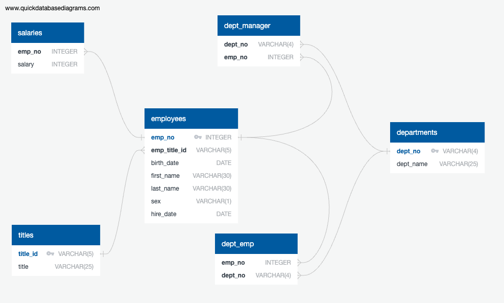

# sql-challenge
**Objective**: Use PostgreSQL (pgAdmin 4) to design tables for employee data from CSV files, import the data into the database, and perform data modelling, engineering, and analysis.

## Tools
- [QuickDBD](https://app.quickdatabasediagrams.com/#/)
- PostgreSQL: [Download](https://www.enterprisedb.com/downloads/postgres-postgresql-downloads)
- pgAdmin: [For macOS](https://www.pgadmin.org/download/pgadmin-4-macos/) or [Windows](https://www.pgadmin.org/download/pgadmin-4-windows/)

# Employee Data
The CSV files in the "data" folder contain the following information:
- departments: Department numbers and names.
- dept_emp: Maps employee numbers to their department numbers.
- dept_manager: Lists department managers with their department numbers and employee numbers.
- employees: Contains employee numbers, title ID, birth date, first name, last name, sex, and hire date.
- salaries: Lists the salary of each employee.
- titles: Contains Title IDs and job titles.

## Setup and Usage
1. Clone the `sql-challenge` repository to your local computer.
2. Navigate to the cloned directory.
3. Open pgAdmin, create a new database named `employee_db`.
4. Open the **Query Tool** and copy contents from the SQL file `create_tables.sql` to create the tables to hold the data from the CSV files.
5. Right-click on the table names under **Schemas** -> **public** -> **Tables**, and select **Import/Export Data...** to import the CSV files into the respective tables.
6. Open a new **Query Tool** window and execute the queries from `data_analysis.sql` to verify the data was imported into the tables and perform the data analysis.

## Entity Relationship Diagram (ERD)

## Table Schema (create_tables.sql)
This SQL script creates the six tables in the database: `departments`, `dept_emp`, `dept_manager`, `employees`, `salaries`, and `titles`. It also establishes the relationships between the tables.

## SQL Query (data_analysis.sql)
This SQL script contains the following queries for data analysis:
- List the employee number, last name, first name, sex, and salary of each employee.
- List the first name, last name, and hire date for the employees who were hired in 1986.
- List the manager of each department along with their department number, department name, employee number, last name, and first name.
- List the department number for each employee along with that employee’s employee number, last name, first name, and department name.
- List first name, last name, and sex of each employee whose first name is Hercules and whose last name begins with the letter B.
- List each employee in the Sales department, including their employee number, last name, and first name.
- List each employee in the Sales and Development departments, including their employee number, last name, first name, and department name.
- List the frequency counts, in descending order, of all the employee last names (how many employees share each last name).
